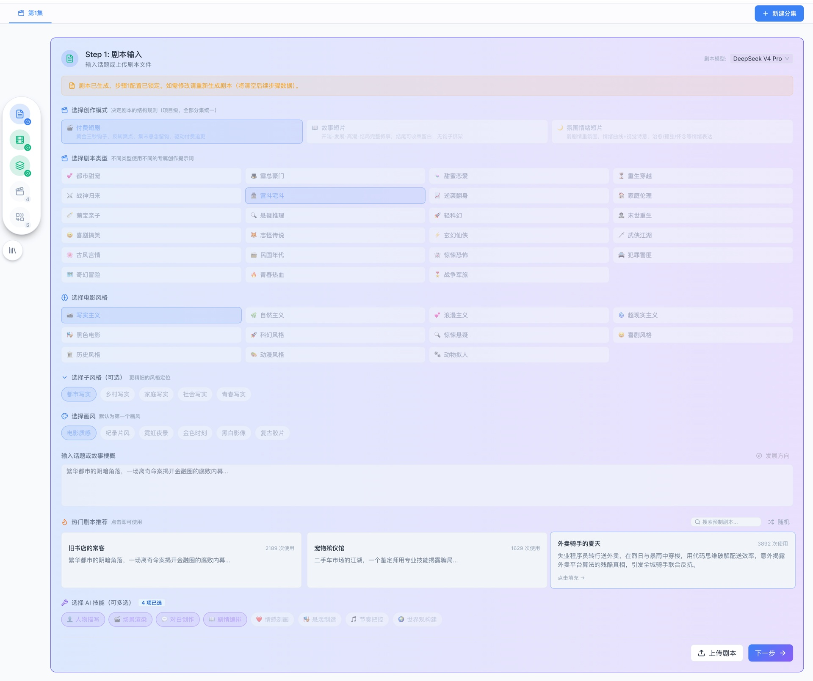
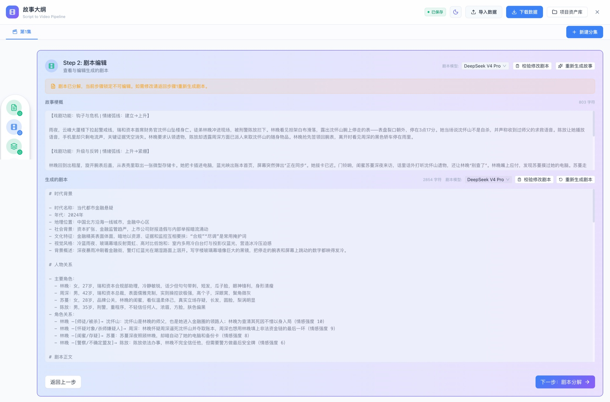
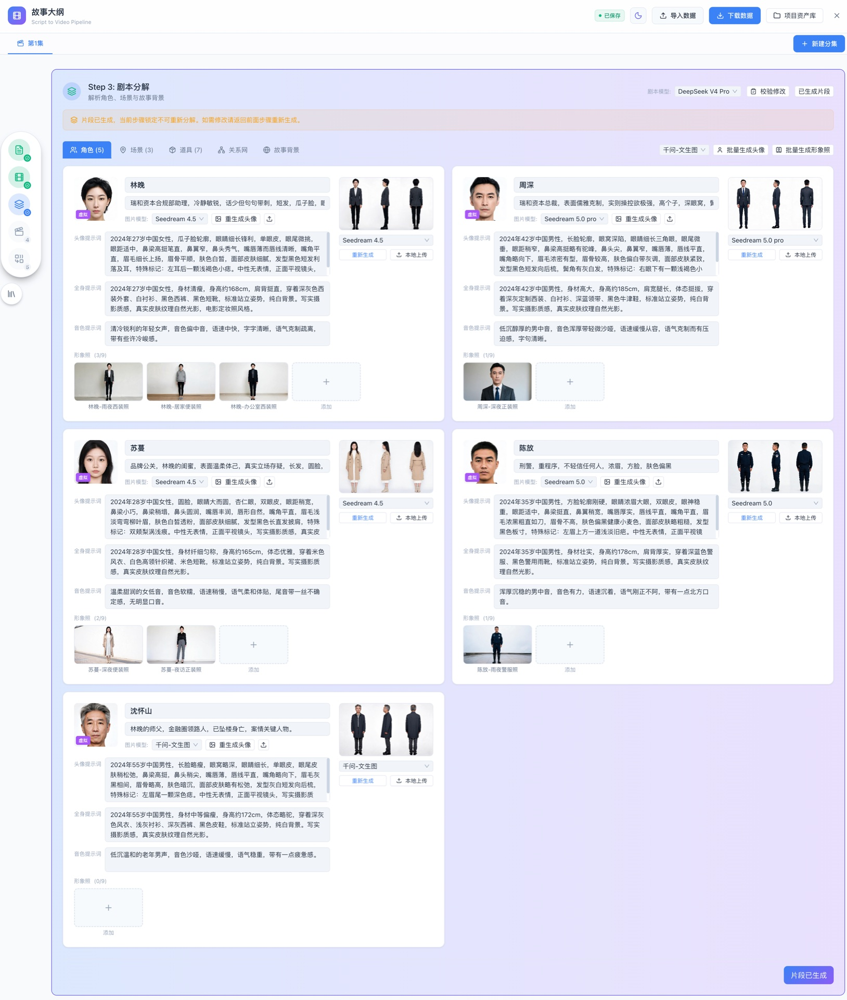
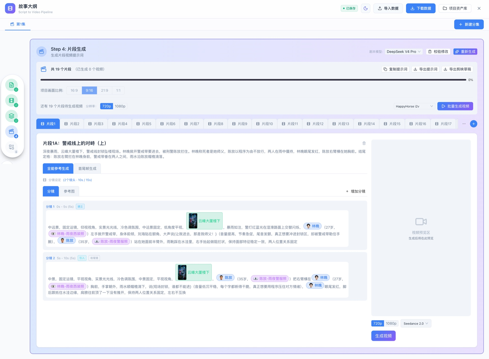

# ShotLib — 开源 AI 短剧创作工作台

纯前端的 AI 短剧创作工具：在浏览器里完成 **剧本 → 审阅 → 分镜 → 资产图 → 首尾帧 → 视频** 的完整链路，以及画布式「即时创作」模式。无后端、无账号，你的 API Key 与全部数据只存在你自己的浏览器里。

> 内置两种创作模式：
> - **剧本模式**(5 步工作流)：生成剧本 → 剧本审阅/修改 → 剧本分解(角色/场景/道具) → 资产图生成 → 分镜片段与视频生成
> - **即时创作**(无限画布)：场景卡片自由编排，角色/场景/分镜/视频即点即生成

## 功能特性

- 📝 **剧本生成与改编**：题材工艺库 + 事件分桶(防剧情提前泄露) + 上集结尾状态(跨集连续性锚点)
- 🎭 **角色资产管理**：头像 / 三视图 / 形象照生成，按分集引用
- 🏞 **场景与道具**：多视角场景图、场景属性向导与随机灵感库
- 🎬 **分镜与视频**：AI 分镜 → 首尾帧生成 → 图生视频 / 首尾帧生视频 / 全能参考生视频，任务自动轮询与刷新恢复
- 🧩 **即时创作画布**：拖拽编排场景卡，分镜编辑器、镜头级首尾帧
- 🔑 **自带 Key**：支持 7 家厂商、文本/图片/视频/音乐共 20+ 个模型，前端统一编排
- 🛡 **数据本地化**：项目 / 分集 / 生成的图片全部存在浏览器 IndexedDB，支持 JSON 导出/导入
- 🗄 **OSS 持久化**：配置对象存储后，生成的图片立即上传，业务数据引用持久公网 URL(解决厂商签名 URL 过期)
- 📟 **请求日志面板**：所有厂商请求(方法/路径/耗时/请求体/响应)记录可查，视频轮询自动合并；任务队列进度可视

## 页面预览

剧本模式的四步工作流(点击查看大图)：

| Step 1 · 剧本输入 | Step 2 · 剧本编辑 |
|---|---|
|  |  |
| **Step 3 · 剧本分解** | **Step 4 · 片段生成** |
|  |  |

## 快速开始

```bash
# 要求 Node.js >= 20
npm install
npm run dev           # 开发模式 http://localhost:5176
npm run build         # 产出到 dist/
```

首次使用：运行 `npm run cli` 配置各厂商 API Key 与默认模型(见下)，或在应用「设置」页中手动填写。

## 本地部署

`deploy.sh` 是一键本地部署脚本，执行后会自动完成依赖安装(按需)、生产构建、启动本地静态服务：

```bash
./deploy.sh           # 默认启动 http://127.0.0.1:8080
```

### deploy.sh 参数

| 参数 | 说明 |
|---|---|
| (无) | 安装依赖(按需) → 构建 → 启动本地静态服务(默认 `127.0.0.1:8080`) |
| `--dev` | 开发模式，直接 `npm run dev`(端口 5176) |
| `--config` | 先运行配置 CLI，再继续部署 |
| `--proxy` | 强制后台启动本机代理 `proxy/node-proxy.mjs`(默认端口 8787) |
| `--no-proxy` | 禁止自动启动代理(即使配置了 `proxyUrl`) |
| `--port N` | 指定静态服务端口 |
| `--host H` | 指定监听地址(注意：`runtime/app-config.json` 含明文 API Key，慎对外暴露) |

> 代理自动启动：CLI 配置了 `proxyUrl`(如 `http://127.0.0.1:8787`)时，部署会**自动附带启动本地代理**——火山引擎/阿里云/MiniMax 等厂商浏览器无法直连，必须经代理转发；端口已有代理监听时直接复用。如使用远程代理或不需要代理，传 `--no-proxy` 关闭。

### 分步部署

如果你希望手动控制构建和服务：

```bash
npm run build         # 构建生产包到 dist/
npm run serve         # 本地静态服务，默认 http://127.0.0.1:8080
npm run serve -- --port 9000 --host 0.0.0.0
```

## 配置 API Key

ShotLib 支持两种配置方式，任选其一：

### 方式一：应用内设置页

进入任意创作页，点击右上角「设置」→ 在 **API Key** 中填入你在对应厂商平台申请的密钥。

| 厂商 | 用途 | 控制台入口 |
|---|---|---|
| 火山引擎(即梦/豆包) | 文本 / 图片 / 视频 | [火山方舟控制台](https://console.volcengine.com/ark) |
| 阿里云百炼 | 图片 / 视频 | [百炼控制台](https://bailian.console.aliyun.com/) |
| DeepSeek | 文本 | [开放平台](https://platform.deepseek.com/) |
| Moonshot(Kimi) | 文本 | [开放平台](https://platform.moonshot.cn/) |
| MiniMax | 文本 / 视频 | [开放平台](https://platform.minimaxi.com/) |
| Suno | 音乐(占位) | — |

> 模型清单与能力(时长上限 / 参考图 / 首尾帧等)内置于 `src/config/models/*.json`，可自行增删变体。

### 方式二：配置 CLI(部署级预置)

```bash
npm run cli                                  # 交互式向导：逐厂商配置 API Key，选择默认模型，配置代理与 OSS
npm run cli show                             # 查看当前配置
npm run cli set-key volcengine <你的Key>      # 非交互：设置某厂商 Key
npm run cli set-model text deepseek-v4-pro   # 非交互：设置默认模型(text/image/video)
npm run cli clear-key volcengine             # 清除某厂商 Key
npm run cli set-oss <bucket> <region> <ak> <sk> [provider] [endpoint] [publicBaseUrl]
                                             # 非交互：配置对象存储(生成图片立即上传)
npm run cli clear-oss                        # 清除 OSS 配置
npm run cli reset                            # 删除部署级配置
```

### 方式三：对象存储 OSS(生成图片持久化)

厂商返回的图片 URL 是带过期时限的签名地址(如火山 TOS 24 小时)，后续视频生成以图片 URL 作参考图时会失效。配置 OSS 后，**每张生成的图片立即上传**，业务数据引用持久公网 URL：

```bash
# CLI 配置(也可在应用「设置 → 对象存储」中填写)
npm run cli set-oss files-shotlib oss-cn-beijing <AccessKeyId> <AccessKeySecret>
```

要求与说明：

- Bucket 需为**公共读**(厂商服务器要能直接拉取参考图)
- 上传请求自动经「代理地址」转发(与厂商 API 同一套代理)，无需为 OSS 单独配置 CORS
- 设置页提供「测试连接」(上传 1×1 PNG 验证凭证/权限/公共读)
- 未配置 OSS 时行为不变：图片以 Blob 存浏览器本地，厂商 URL 过期后后续生成引用会失效
- 凭证仅存本机(`runtime/app-config.json` 或浏览器 IndexedDB)，不会上传任何服务器

## 图片持久化与刷新恢复

生成的图片遵循「本地 Blob + 远程 URL」双层策略：

1. **生成时**：图片 Blob 立即存入浏览器 IndexedDB(`imageasset:{projectId}:{assetId}`)，业务数据(角色/场景/道具)只引用 `assetId`
2. **展示时**：通过 assetId 从 IndexedDB 解析为可展示地址，刷新页面后自动还原
3. **配置 OSS 后**：落库的同时立即上传对象存储，业务数据引用持久公网 URL——后续视频生成以图片 URL 作参考图时不再受厂商签名地址过期影响

> 若日志面板出现「图片 blob 落库失败」警告，说明该图未成功本地化(通常为代理未启动)，刷新后将无法恢复，请重新生成。

## 请求日志与任务面板

页面右下角浮动工具条(所有页面可用)：

- **任务**：生成任务队列(进行中/轮询次数/失败原因)，未提交模型的任务可取消
- **日志**：所有厂商请求的完整记录——厂商、方法、路径、耗时、状态、请求体与响应 JSON、错误信息，支持按级别/方法/厂商/来源过滤与搜索。视频任务的同 URL 轮询自动合并为一条并累计次数，不会刷掉关键日志
- **预览开关**：开启后每次提交模型前先弹出请求 JSON 预览确认(调试用；也可在「设置 → 提交模型预览」中持久开启，默认关闭直接提交)

## 画面比例说明

- **多视图 / 形象照 / 场景图 / 道具图**：生成与显示**固定 16:9**，不随项目比例变化
- **分镜图 / 首尾帧 / 视频**：跟随项目创建时选择的「画面比例」(9:16 / 16:9 / 21:9)

## 配置机制说明

- CLI 配置写入 `runtime/app-config.json`(明文保存，已被 `.gitignore` 忽略)
- 本地部署服务(`scripts/serve.mjs`)和开发服务器(`vite.config.ts`)都会把该文件以 `/app-config.json` 暴露给前端
- 前端页面加载时，按文件中的 `generatedAt` 版本号只合并一次：
  - CLI 每次保存后会刷新 `generatedAt`，下次刷新页面时以 CLI 配置覆盖同名项
  - 之后在设置页手动修改不会被反复覆盖，直到 CLI 再次保存

### 配置优先级

```
CLI 配置文件(每次保存后生效一次) > 浏览器设置页 > VITE_DEFAULT_PROXY_URL
```

> ⚠️ 安全提示：`runtime/app-config.json` 含明文 API Key，仅建议本机部署使用；如需对外提供服务，请自行做好访问控制。

## 网络与代理(重要)

部分厂商接口**不允许浏览器跨域直连**(CORS 限制)，典型如火山方舟、阿里云百炼、MiniMax；DeepSeek / Moonshot 可直接直连。对受限厂商，应用支持把请求经你自有的轻量代理转发：

### 方案 A：Cloudflare Worker(推荐，免费额度充足)

1. 登录 Cloudflare Dashboard → Workers & Pages → Create Worker
2. 粘贴 [`proxy/cloudflare-worker.js`](proxy/cloudflare-worker.js) 全部内容，Deploy
3. (强烈建议)在 Worker 的 Settings → Variables 添加 `ACCESS_TOKEN`，开启简单鉴权
4. 应用「设置 → 网络」：填入 Worker 地址，并为对应厂商打开「走代理」

### 方案 B：本机 Node 代理(本地开发)

```bash
./deploy.sh                          # CLI 配置了 proxyUrl 时自动附带启动,默认监听 8787
# 或强制启动/单独运行：
./deploy.sh --proxy                  # 部署同时强制附带启动
node proxy/node-proxy.mjs            # 默认监听 8787
# ACCESS_TOKEN=your-secret node proxy/node-proxy.mjs
```

应用「设置 → 网络」填入 `http://localhost:8787`。

### 各厂商默认建议

以 `src/config/models/*.json` 中的 `proxyDefault` 为准(当前：aliyun / minimaxi / volcengine 默认建议走代理，deepseek / moonshot 直连)。每个厂商都可以在设置中手动覆盖。

## 数据与隐私

- **不采集任何数据**：没有后端、没有埋点、没有账号体系。剧本、分集数据、生成的图片、API Key 全部存在你浏览器的 IndexedDB / localStorage 中。
- **AI 调用直达厂商**：浏览器把请求(携带你的 Key)直接发往(或经你自建代理转发)对应厂商接口，除此之外没有任何第三方经手。
- **请自行备份**：清理浏览器站点数据会清空全部项目。重要项目请定期使用「设置 → 数据管理」导出 JSON；配置 OSS 后图片另有云端副本。
- 视频生成结果返回的是厂商对象存储的临时 URL，有效期由厂商决定，建议及时下载保存(图片可通过 OSS 配置持久化，见上)。

## 目录结构

```
├── deploy.sh               # 一键本地部署(安装依赖 → 构建 → 启动)
├── scripts/                # cli.mjs 配置 CLI / serve.mjs 本地静态服务
├── proxy/                  # 可选轻量代理(CF Worker / Node 单文件)
├── src/
│   ├── ai/                 # AI 编排层：厂商 adapter、统一 SDK、视频任务轮询器
│   ├── config/             # 模型清单 / 提示词模板 / 预设数据(全部内置)
│   ├── modules/
│   │   ├── projects/       # 项目列表(两种模式互通)
│   │   ├── workflow/       # 剧本模式 5 步工作流
│   │   └── instant/        # 即时创作画布
│   ├── settings/           # 设置页(API Key / 网络 / 默认模型 / 数据管理)
│   ├── shared/             # 通用组件 / store / 工具
│   └── storage/            # IndexedDB 仓储层(项目/分集/图片/设置)
```

## 已知限制(相对内部完整版)

- ❌ 服务端视频合成(ffmpeg 拼接)、TTS 配音、智能扩图(需云厂商签名密钥)、剪映导出
- ❌ 多端云同步 / 团队协作；异步任务队列(改为浏览器端直连 + 前端轮询)
- ⚠️ 个别厂商视频接口仅接受公网参考图 URL 时，本地 blob 图片会以 data URL 传入；**配置 OSS 后**图片引用为持久公网 URL，此问题即可规避

## 开发

```bash
npx tsc --noEmit -p tsconfig.app.json   # 类型检查
npm run build
```

新增厂商 / 模型：在 `src/config/models/` 增加配置、`src/ai/providers/` 实现 adapter(参照现有 7 家)，不改业务代码。

## License

[Apache-2.0](LICENSE)
